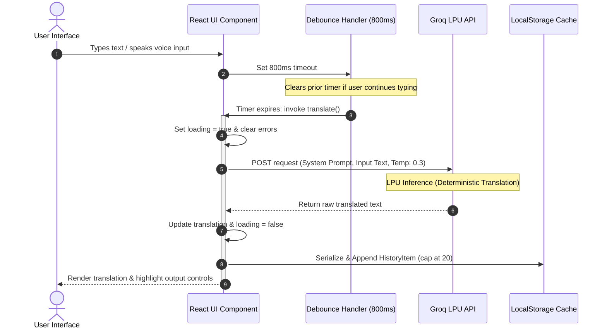

<div align="center">
  

  <br />

  <h3>⚡ Enterprise-Grade Real-Time AI Translation Platform</h3>

  <p>
    A high-performance, polished translation web application powered by the <b>Groq LPU Inference Engine</b>. 
    It features direct integration with native browser Web Speech APIs, persistent localized history, and a stunning 
    fully-customized Glassmorphic interface built using <b>React 19, TypeScript, and Tailwind CSS v4</b>.
  </p>

  <br />

  <p>
    <a href="https://react.dev"></a>
    <a href="https://www.typescriptlang.org"></a>
    <a href="https://vite.dev"></a>
    <a href="https://tailwindcss.com"></a>
    <a href="https://motion.dev"></a>
    <a href="https://groq.com"></a>
  </p>

  <p>
    <a href="#-why-this-project-stands-out">Key Architectural Highlights</a> • 
    <a href="#-data-flow-architecture">Data Flow Diagram</a> • 
    <a href="#-features--deep-dives">Feature Breakdown</a> • 
    <a href="#-quick-start">Developer Guide</a>
  </p>
</div>

<br />

---

## 📌 Why This Project Stands Out

Rather than acting as a simple wrapper around Google Translate, **Translify AI** was engineered from scratch to demonstrate full-stack performance optimization, browser API mastery, and strict architectural discipline.

| Engineering Domain | Technical Accomplishment | Business & UX Benefit |
| :--- | :--- | :--- |
| **LPU-Driven Inference** | Integrated directly with the Groq inference endpoint using LLaMA models configured at `temperature: 0.3`. | Sub-second, context-aware translations that feel instantaneous compared to standard LLM endpoints. |
| **Keystroke Throttling** | Developed a custom `useRef` + `setTimeout` debounce wrapper (800ms threshold) blocking duplicate API invocations. | Minimizes network payload overhead and shields API rate-limits/billing from rapid user keystrokes. |
| **Browser Speech APIs** | Built unified event listeners interfacing `webkitSpeechRecognition` (voice input) and `SpeechSynthesisUtterance` (vocal reading). | Hands-free accessibility and pronunciation verification operating entirely on the client-side without third-party audio costs. |
| **Optimized Local Caching** | Implemented a lazy-loading state initializer for React to parse and cap local history to the last 20 queries. | Eliminates expensive JSON deserialization during component re-renders, securing persistent offline restoration. |
| **GPU-Accelerated Styling** | Crafted a glassmorphism theme using CSS variables on the `:root` pseudo-class rather than heavy JS layouts. | Seamless dual-theme styling transitions offloaded directly to the browser GPU with zero layout shift or rendering delay. |
| **Type-Safe Development** | Designed strict TypeScript mappings defining response payloads, custom speech event handlers, and data interfaces. | Absolute runtime safety and predictable development cycle with no `any` fallbacks. |

---

## 🏗️ Data Flow Architecture

The sequence diagram below visualizes the life cycle of a translation request: from user input capture, through the debounce bottleneck, Groq LPU completion, and final local serialization.



---

## ✨ Features & Deep Dives

### 🧠 Context-Aware Translation Engine
* **Prompt Isolation:** Evaluates source text using an explicit system persona instruct: *"Translate the user's text from [Source] to [Target]. Return ONLY the translated text. No explanations, no notes, no quotes."*
* **Low Latency:** Leveraging Groq's high-speed inference hardware delivers translations in a fraction of the time required by standard GPT interfaces.
* **Smart Debounce:** Prevents intermediate state thrashing using a react-compliant timeout cleanup loop:
  ```typescript
  useEffect(() => {
    if (debounceRef.current) clearTimeout(debounceRef.current);
    if (!text.trim()) { setTranslated(''); return; }
    
    debounceRef.current = setTimeout(() => translate(text, sourceLang, targetLang), 800);
    return () => { if (debounceRef.current) clearTimeout(debounceRef.current); };
  }, [text, sourceLang, targetLang, translate]);
  ```

### 🎙️ Bidirectional Audio & Web Speech APIs
* **Live Transcription (Speech-to-Text):** Instantiates the native `window.SpeechRecognition` object. Matches recognition targets (`recognition.lang`) to the selected source language dynamically to prevent phonetic distortion.
* **Speech Synthesis (Text-to-Speech):** Utilizes `SpeechSynthesisUtterance` to read out translated targets. Automates voice assignment (e.g. `fr` for French, `ja` for Japanese) matching the target locale. Includes audio abort controls (`speechSynthesis.cancel()`) to terminate playback instantly on click.

### 💾 Performance-Optimized History
* **Lazy State Deserialization:** The history array initializes only once during the application's mount cycle, saving CPU cycles on subsequent state modifications:
  ```typescript
  const [history, setHistory] = useState<HistoryItem[]>(() => {
    try {
      return JSON.parse(localStorage.getItem('translify-history') || '[]');
    } catch { return []; }
  });
  ```
* **Granular Sidebar Control:** Users can slide out a spring-animated drawer using Framer Motion to view past history logs, select items to overwrite current editor panels, or target specific records for deletion.

### 🌓 GPU Theme Switching
* Swapping theme configurations avoids expensive paint reflows by toggling `.dark` and `.light` attributes on the parent `<html>` element.
* CSS variables (`--bg`, `--text-primary`, `--bg-glass`, `--border-glass`) define all component dimensions. A global transition handler (`transition: background-color 0.3s ease-in-out, border-color 0.3s ease-in-out`) shifts color maps on GPU layer configurations.

### 📋 Native Web Integrations
* **Web Share API:** Opens the OS-native sharing sheet (messaging, email, socials) on mobile interfaces via `navigator.share()`.
* **Clipboard API:** Interfaces with `navigator.clipboard.writeText()` featuring user micro-interactions (copies target and triggers a visual green check indicator for 2000ms).

---

## 📂 Project Directory Structure

```
translify-ai/
├── src/
│   ├── components/
│   │   ├── CTA.tsx                  # Premium conversion panel
│   │   ├── Features.tsx             # Interactive feature matrices
│   │   ├── Footer.tsx               # Branding, social triggers & legal links
│   │   ├── Hero.tsx                 # Parallax landing module with glowing background shapes
│   │   ├── HowItWorks.tsx           # Stepped layout explaining translation workflow
│   │   ├── Navigation.tsx           # Responsive navigation with absolute theme toggles
│   │   ├── Testimonials.tsx         # Scroll-animated cards showing global client feedback
│   │   └── TranslationInterface.tsx # Core engine (API triggers, Speech APIs, debouncing)
│   ├── context/
│   │   └── ThemeContext.tsx         # Global context syncing user preferences with local storage
│   ├── App.tsx                      # App component tree with layout wrappers
│   ├── index.css                    # Design system tokens (glassmorphism details, animations)
│   ├── main.tsx                     # Entry point mounting components under React 19 StrictMode
│   └── vite-env.d.ts                # TypeScript global type overrides (e.g., SpeechRecognition APIs)
├── public/                          # Static brand assets
├── vite.config.ts                   # Fast HMR building rules using Tailwind v4 vite hooks
├── tsconfig.json                    # Strict type validation configurations
├── package.json                     # Dependency manifests
└── .env                             # Local API keys (Gitignored)
```

---

## ⚙️ Quick Start

### 📋 Prerequisites
* **Node.js** v18.0.0 or higher
* A free **[Groq Console API Key](https://console.groq.com/keys)**

### 🚀 Getting Started

1. **Clone the Repository:**
   ```bash
   git clone https://github.com/Vamshimamidipelli/translify-ai.git
   cd translify-ai
   ```

2. **Install Core Dependencies:**
   ```bash
   npm install
   ```

3. **Establish Local Settings:**
   Create a `.env` file in the root folder of the project:
   ```env
   VITE_GROQ_API_KEY=your_groq_api_key_here
   VITE_GROQ_MODEL=llama3-70b-8192
   VITE_GROQ_API_URL=https://api.groq.com/openai/v1/chat/completions
   ```

4. **Launch Local Dev Server:**
   ```bash
   npm run dev
   ```
   Open **`http://localhost:3000`** in your browser.

### 🛠️ Script commands

| CLI Action | Description |
| :--- | :--- |
| `npm run dev` | Spins up the local development server with instant Hot Module Replacement (HMR) on port 3000. |
| `npm run build` | Compiles codebase and bundles assets into highly compressed files under `dist/`. |
| `npm run preview` | Runs the compiled distribution bundle locally for production simulation. |
| `npm run clean` | Purges compiled directories (`dist/`) to reset deployment targets. |
| `npm run lint` | Triggers the TypeScript compiler in dry-run mode (`tsc --noEmit`) to confirm complete type-safety. |

---

## 🛡️ Future Enhancements
- [ ] **Secure Node API Proxy:** Shift client-side Groq requests to an express-based backend middleware protecting the API key in public bundles.
- [ ] **SSE Streaming Translations:** Enable chunk-based stream rendering (`ReadableStream`) to render translations character-by-character.
- [ ] **Audio Waveform Visualizers:** Animate micro-canvas animations during Voice input activations.
- [ ] **Local Redis Caching:** Save common search translations into memory databases to bypass Groq calls entirely.

---

## 👤 Credits

**Vamshi Mamidipelli**

[](https://github.com/Vamshimamidipelli)
[](https://linkedin.com/in/vamshimamidipelli)

---

<div align="center">
  <sub>Designed & engineered with precision by Vamshi Mamidipelli · 2026</sub>
</div>
